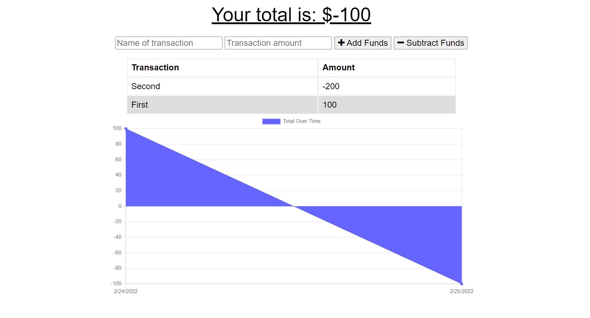

# Budget Tracker

## Description
In this project, I have converted a basic budget tracker into a progressive web application capable of limited offline functionality. Using IndexedDB, inputs from the user will be saved while offline until the user restores online functionality. A service worker was also added to the existing code base such that the application will load with cached files when offline. Finally, the application can be saved to a user's desktop or home screen on mobile due to the addition of a manifest.json. 

## Usage
Site deployed at [Budget Tracker](https://nameless-reef-22073.herokuapp.com/).

